# 相机设置

连接好相机之后，打开realsense，打开“Motion Module”，调整相机的平面倾角使xy的值趋近0。

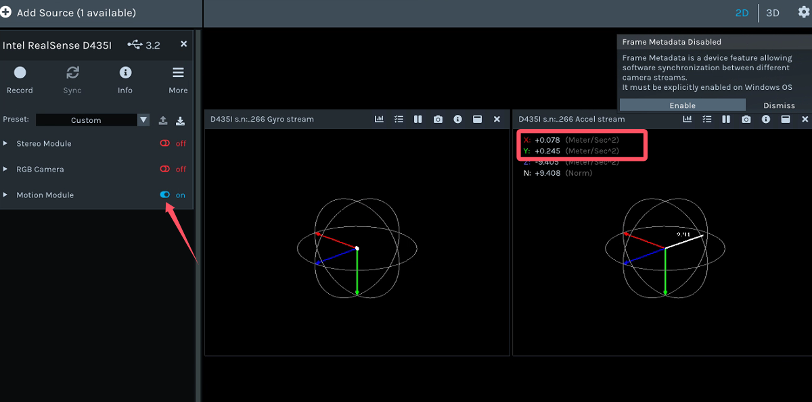

# 机械臂标定

标定采用平面标定的方式。采集相机画面坐标与机械臂平面坐标，计算像素与位姿的缩放参数。需要标定3对坐标：

+ 相机画面左上角与机械臂对应坐标
+ 相机画面右下角与机械臂对应坐标
+ 初始机械臂画面坐标与机械臂坐标

## 初始坐标

运行`camera/realsense_435i.py`程序，相机会被打开。程序默认绿框左上（340, 200）角为初始坐标。

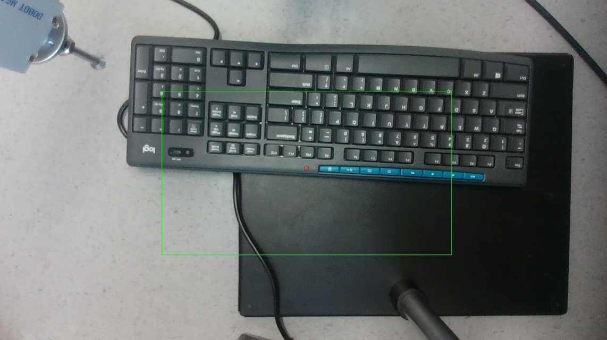

打开DobotStudio控制机械臂移动到画面中绿框对应的位置，记录机械臂的x,y。如图示例，绿框左上角是“键盘6”，将机械臂移动到“键盘6”的位置，记录机械臂坐标（266.37, -155.05）。

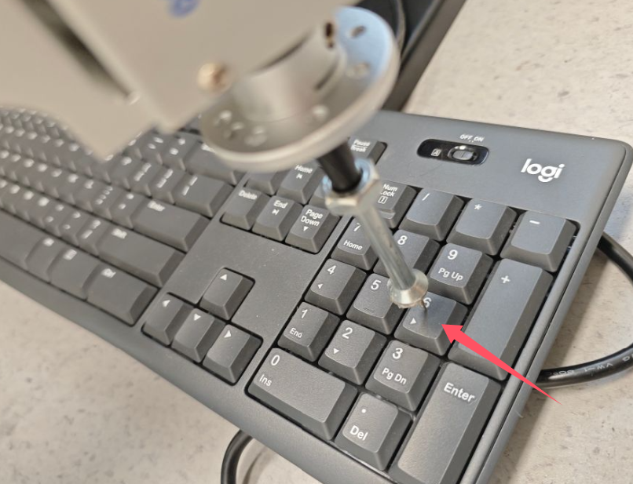

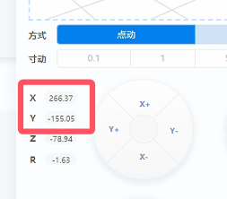

打开`cali.json`文件，将init_pos中的pos_x,pos_y分别改成机械臂的坐标。

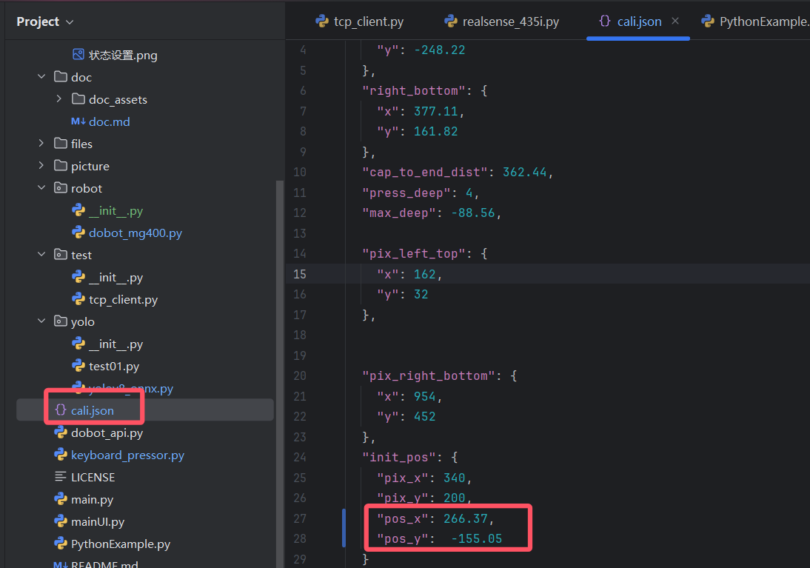

## 左上角与右下角

在画面的左上角选择一个机械臂可以到达的坐标点，使用鼠标点击，控制台会输出点击的像素坐标。如下图，鼠标点击了箭头所指位置，控制台输出了点击的坐标。

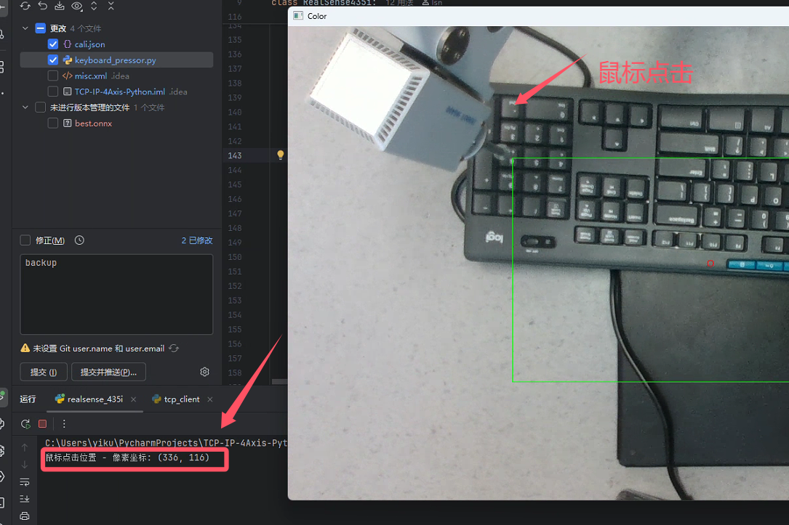

然后控制机械臂移动到像素坐标的位置，记录机械臂的xy。将像素坐标和机械臂坐标分别填到“pix_left_top”与“left_top”中。右下角坐标同理。

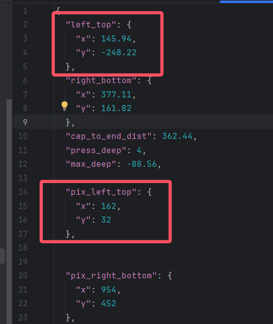

## 高度设置
###  cap_to_keyborad

连接相机后，打开realsense，打卡“Stero Module”选项，可以看到深度图，将鼠标移动到键盘上可以在画面左下角看到深度信息。将深度转换成以mm为单位，填到cap_to_keyborad中。

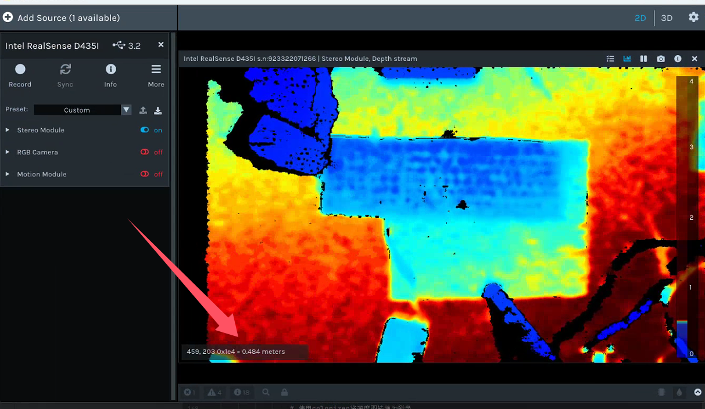

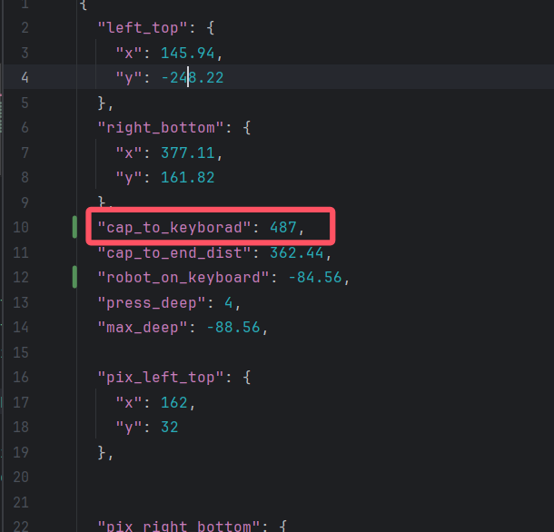

### robot_on_keyboard

控制机械臂移动到键盘上，记录机械臂的z坐标，填到robot_on_keyboard中。

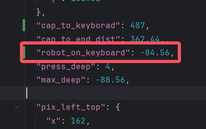

### max_deep

按压键盘，将机械臂移动到最大下压位置，记录z坐标，填到max_deep中。

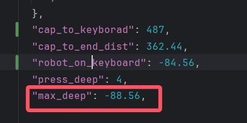

### press_deep

根据robot_on_keyboard与max_deep的差值，得到press_deep并填写。

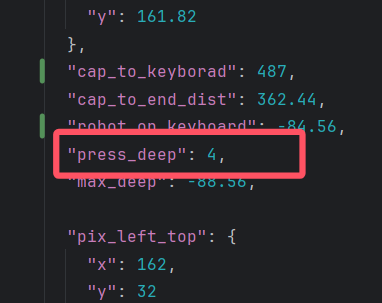

