# Src 模块架构文档

## 系统架构总览

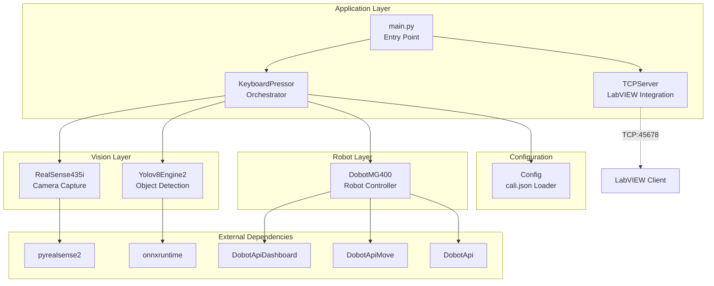

---

## 模块依赖关系

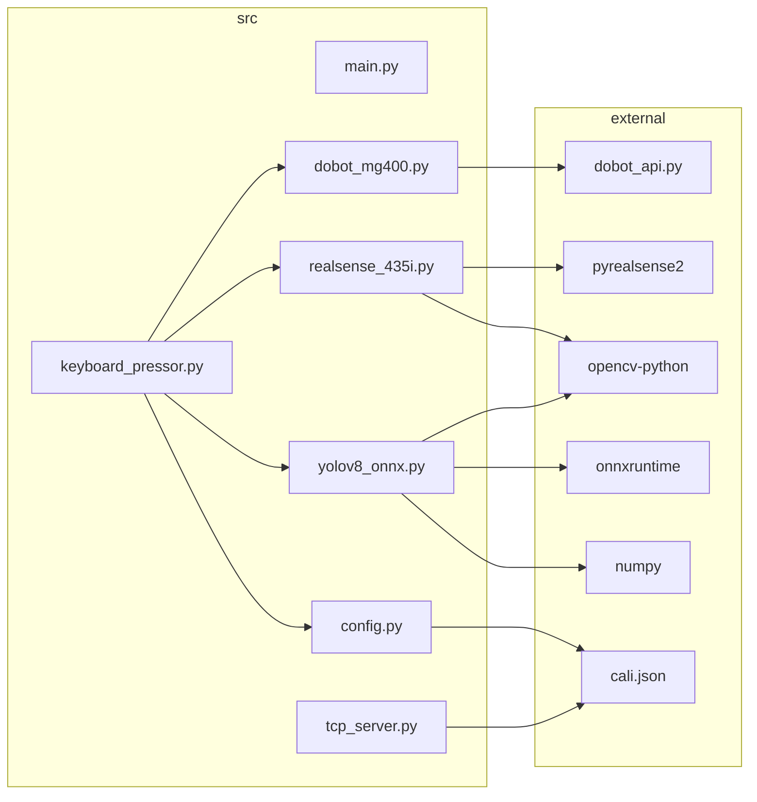

---

## 类架构图

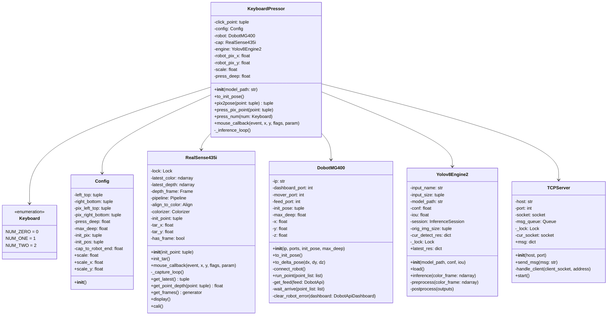

---

## 时序图

### 1. 系统初始化时序图

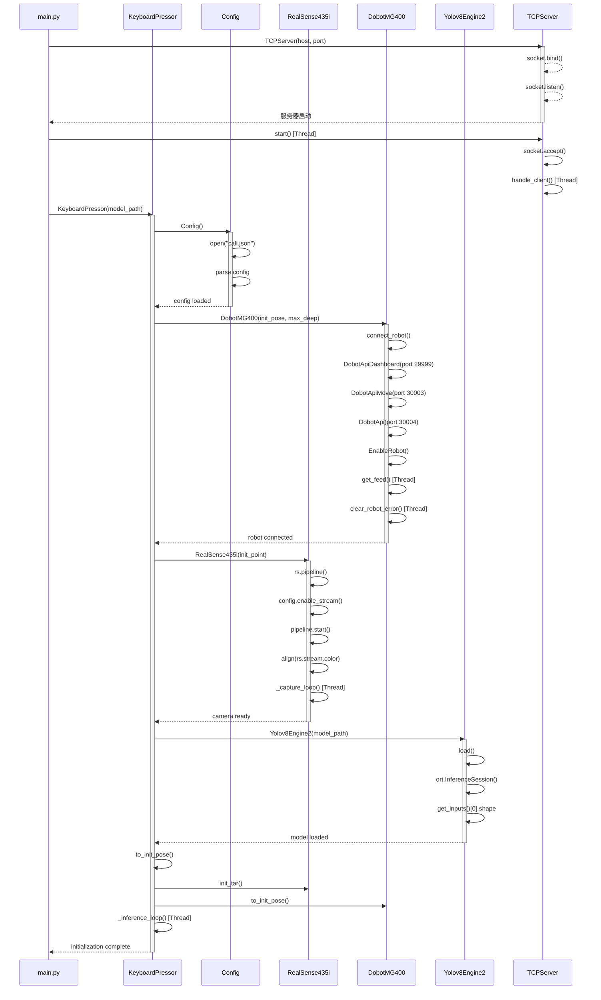

---

### 2. 视觉推理时序图

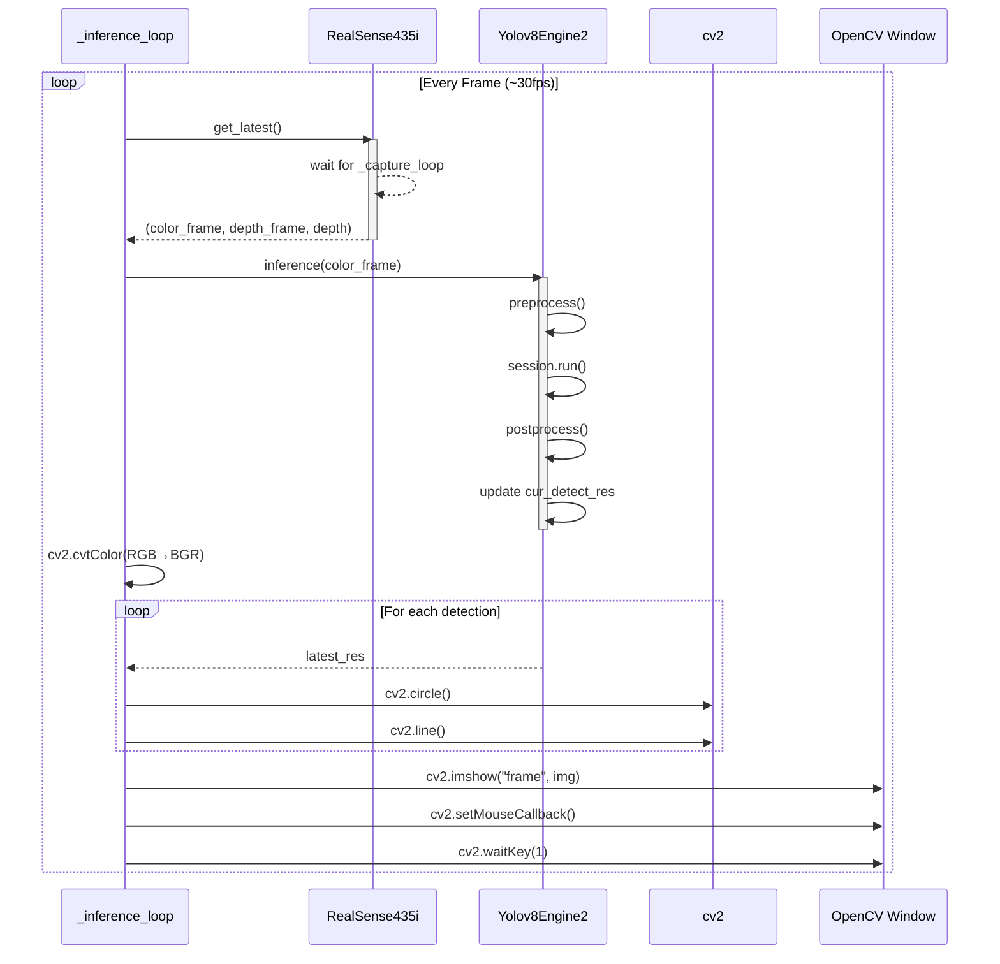

---

### 3. 相机捕获时序图

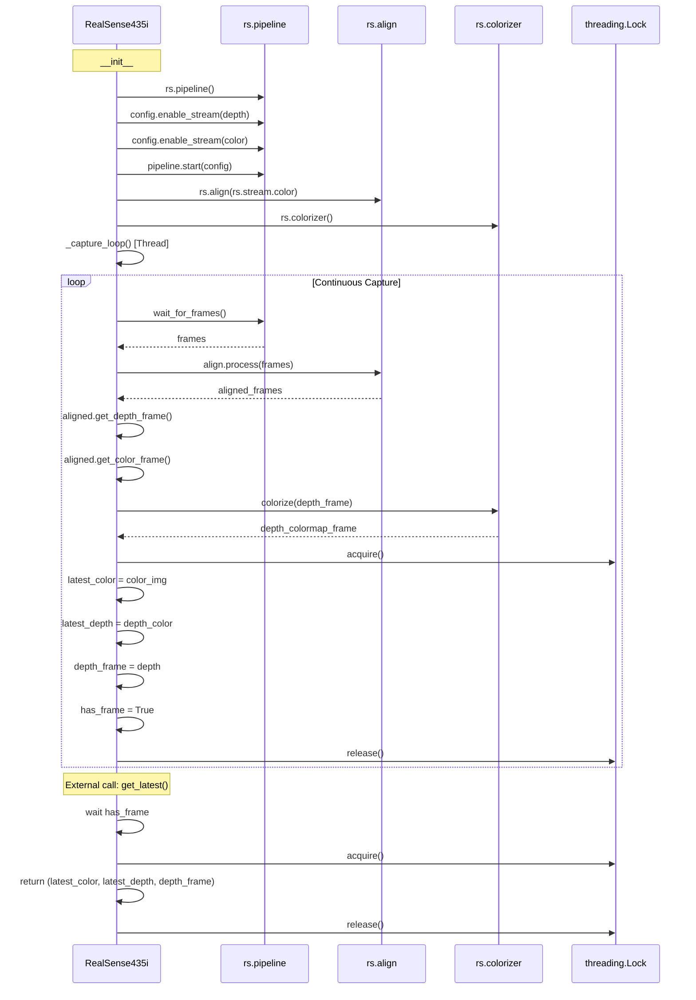

---

### 4. YOLO 推理时序图

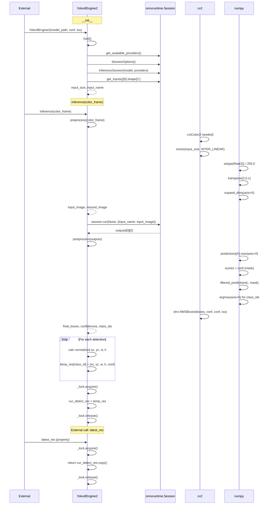

---

### 5. 按键按压时序图 (press_num)

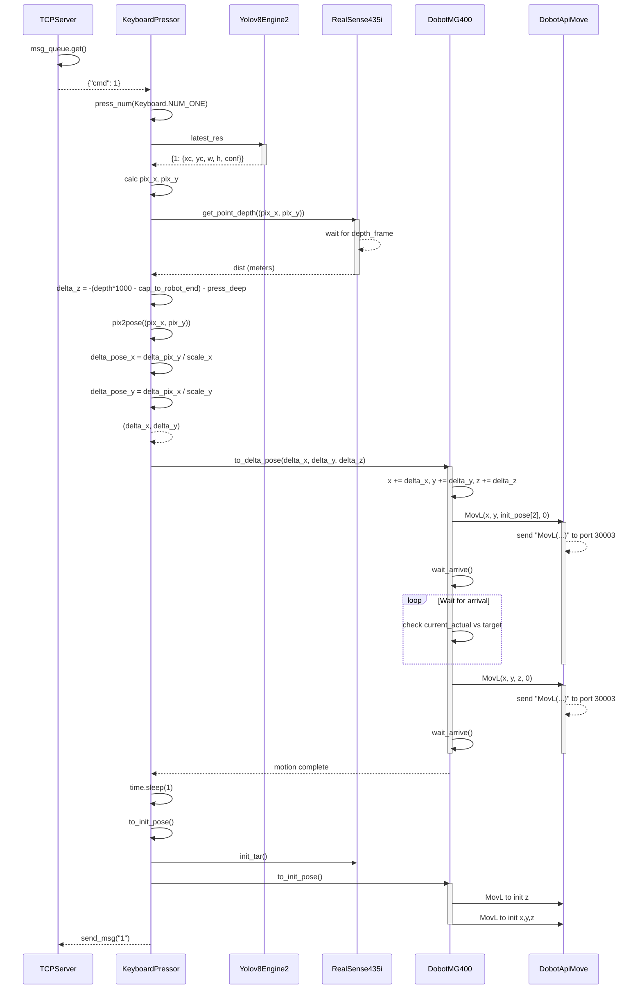

---

### 6. 像素点按压时序图 (press_pix_point)

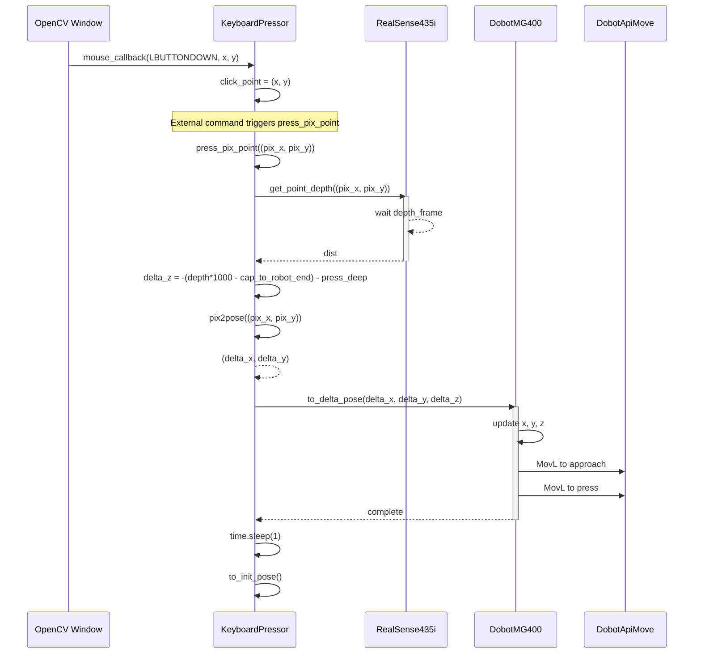

---

### 7. TCP 服务器运行时序图

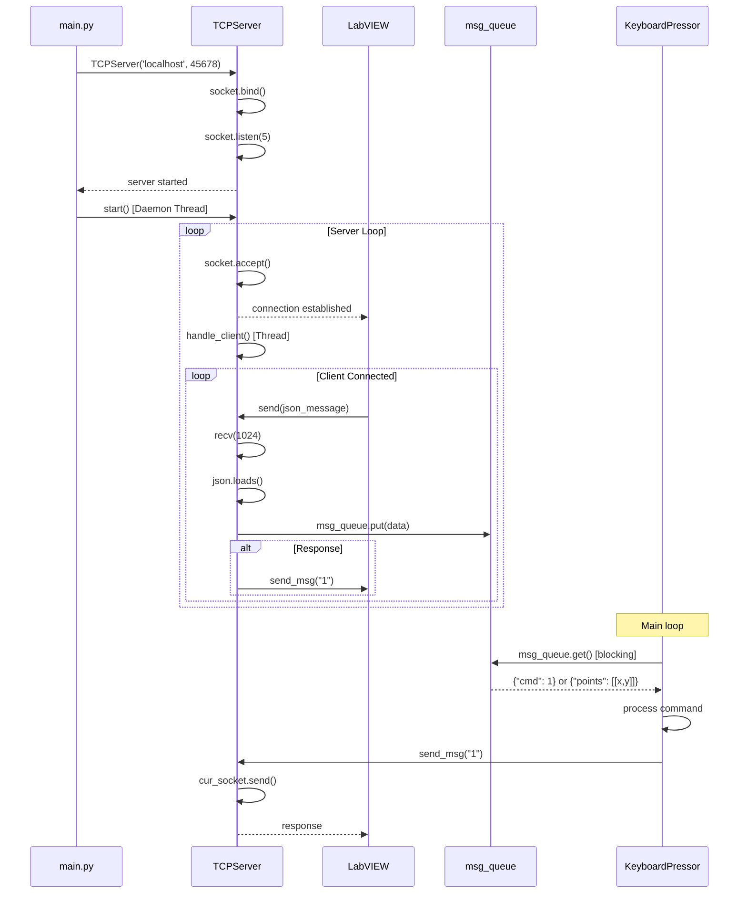

---

### 8. 机器人反馈循环时序图

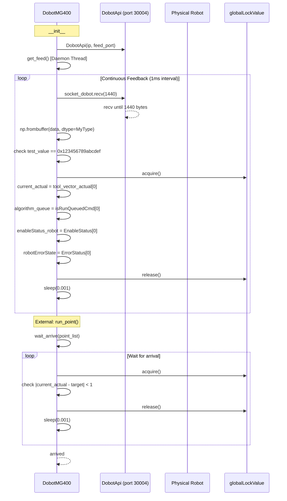

---

### 9. 机器人错误处理时序图

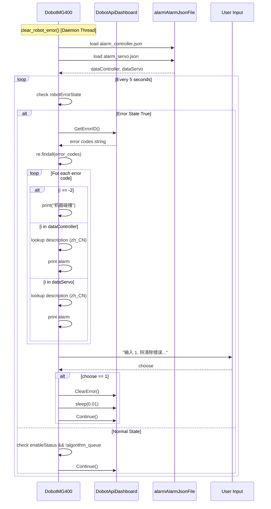

---

## 线程模型总览

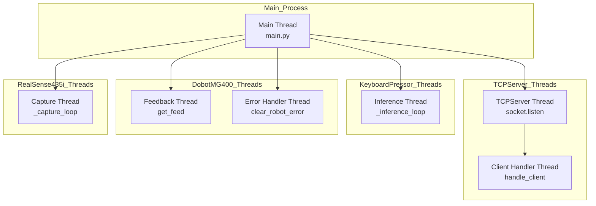

---

## 共享状态与锁

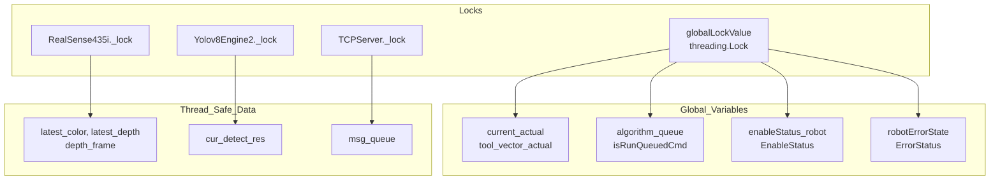

---

## 数据流图

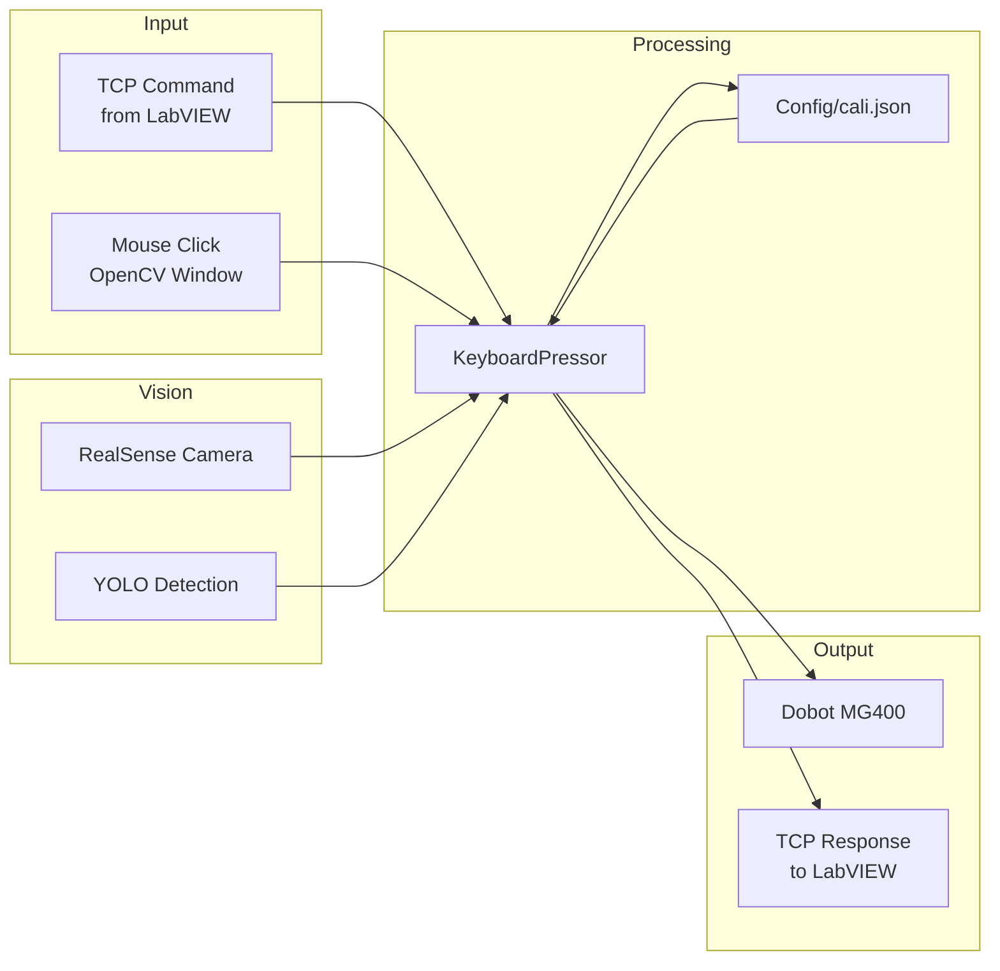

---

## 配置参数说明 (cali.json)

| 参数 | 类型 | 说明 |
|------|------|------|
| `left_top` | {x, y} | 相机视野左上角对应的机械臂坐标 |
| `right_bottom` | {x, y} | 相机视野右下角对应的机械臂坐标 |
| `pix_left_top` | {x, y} | 相机画面左上角像素坐标 |
| `pix_right_bottom` | {x, y} | 相机画面右下角像素坐标 |
| `press_deep` | float | 按键下压深度 (mm) |
| `cap_to_keyborad` | float | 相机到键盘表面距离 (mm) |
| `robot_on_keyboard` | float | 机械臂 Z 轴在键盘表面的坐标值 |
| `max_deep` | float | 最大允许下压深度 Z 坐标 |
| `init_pos` | {pix_x, pix_y, pos_x, pos_y, pos_z} | 初始位置配置 |

### Config 类计算属性

| 属性 | 计算公式 | 说明 |
|------|----------|------|
| `scale` | (y_scale + x_scale) / 2 | 平均缩放比例 |
| `scale_x` | (pix_right_bottom[1] - pix_left_top[1]) / (right_bottom[0] - left_top[0]) | 机械臂 X 轴缩放比例 |
| `scale_y` | (pix_right_bottom[0] - pix_left_top[0]) / (right_bottom[1] - left_top[1]) | 机械臂 Y 轴缩放比例 |
| `cap_to_robot_end` | cap_to_keyborad - robot_to_keyboard | 相机到机械臂末端的距离 |

---

## 关键方法说明

### KeyboardPressor

| 方法 | 作用 | 关键参数 |
|------|------|----------|
| `__init__` | 初始化所有子模块并启动推理线程 | model_path: ONNX 模型路径 |
| `to_init_pose` | 复位到初始位置和状态 | - |
| `pix2pose` | 像素坐标转机械臂增量坐标 | point: (pix_x, pix_y) |
| `press_pix_point` | 按压指定像素位置的点 | point: (pix_x, pix_y) |
| `press_num` | 按压检测到的指定按键 | num: Keyboard Enum |
| `_inference_loop` | 持续捕获帧并运行推理 | - |

### RealSense435i

| 方法 | 作用 | 关键参数 |
|------|------|----------|
| `__init__` | 初始化相机流水线并启动捕获线程 | init_point: 初始目标点 |
| `_capture_loop` | 持续捕获对齐的彩色和深度帧 | - |
| `get_latest` | 获取最新的彩色/深度帧 | - |
| `get_point_depth` | 获取指定像素点的深度值 | point: (x, y) |
| `cali` | 标定模式显示 | - |

### DobotMG400

| 方法 | 作用 | 关键参数 |
|------|------|----------|
| `__init__` | 连接机器人并使能 | ip, ports, init_pose, max_deep |
| `to_init_pose` | 返回初始位置 | - |
| `to_delta_pose` | 移动到相对增量位置 | delta_x, delta_y, delta_z |
| `run_point` | 移动到指定坐标点 | point_list: [x, y, z, r] |
| `get_feed` | 持续读取机器人反馈数据 | feed: DobotApi |
| `wait_arrive` | 等待机器人到达目标位置 | point_list: 目标坐标 |
| `clear_robot_error` | 监控并处理机器人错误 | dashboard: DobotApiDashboard |

### Yolov8Engine2

| 方法 | 作用 | 关键参数 |
|------|------|----------|
| `__init__` | 加载 ONNX 模型 | model_path, conf, iou |
| `load` | 初始化推理会话和配置 | - |
| `inference` | 执行单帧推理 | color_frame: ndarray |
| `preprocess` | 图像预处理 | color_frame: ndarray |
| `postprocess` | 解析输出并应用 NMS | outputs: list |
| `latest_res` | 获取最新推理结果 (线程安全) | - |

### TCPServer

| 方法 | 作用 | 关键参数 |
|------|------|----------|
| `__init__` | 初始化服务器 socket | host, port |
| `start` | 启动服务器监听循环 | - |
| `handle_client` | 处理单个客户端连接 | client_socket, address |
| `send_msg` | 向当前客户端发送消息 | msg: str |
| `msg` | 阻塞获取下一条消息 (property) | - |
